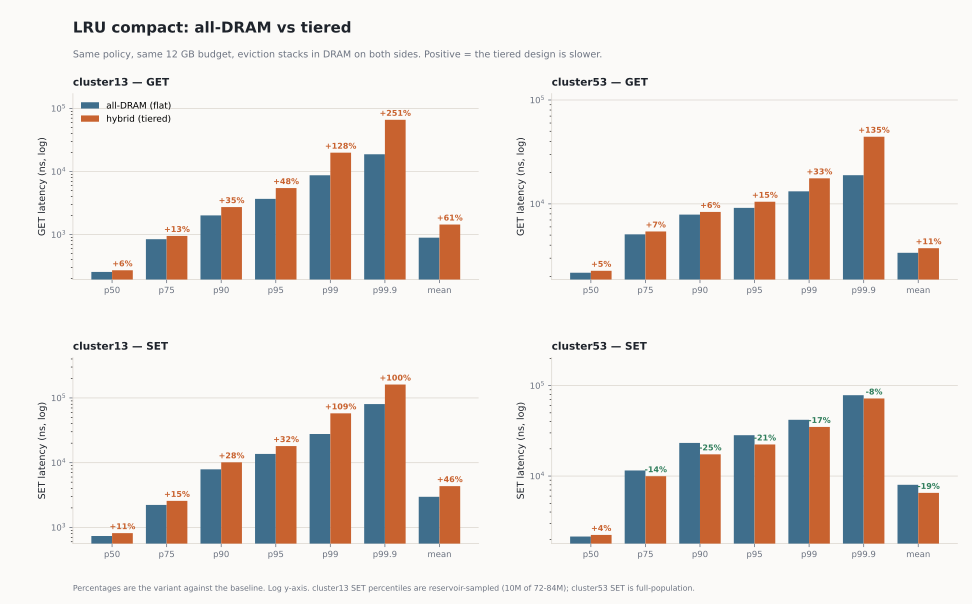
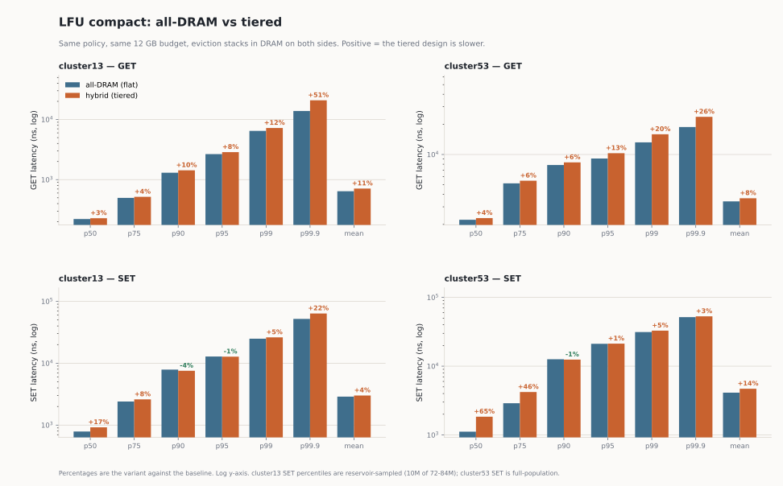
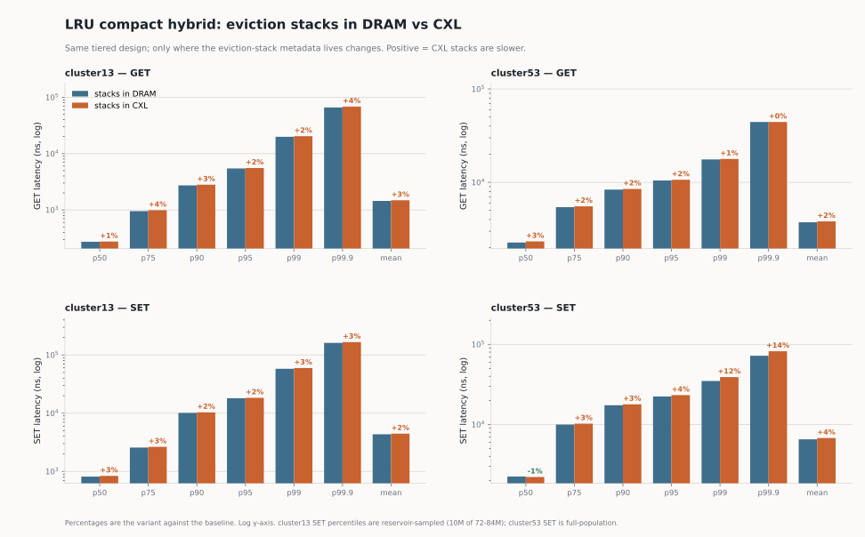
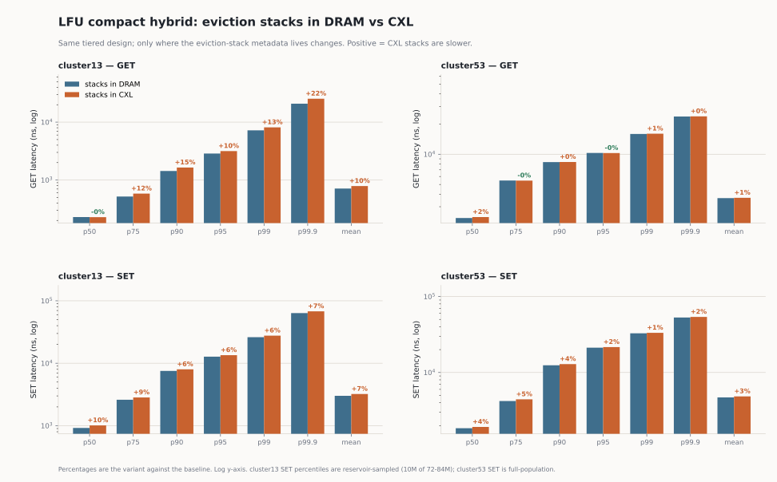

# Eviction stacks in CXL: a measured null result

Sixteen full-trace cells, eight DRAM/CXL pairs, Twitter clusters 13 and 53.
Answers one question: **if the eviction-stack metadata is moved off DRAM into
CXL, what does it cost and what does it buy?**

Short answer: it costs 0.5-2.0% of wall clock and buys nothing, because the
metadata is too small for its relocation to matter and — by design, see
[Accounting](#accounting) — no cache capacity is released in exchange.

Companion to `flat_vs_hybrid_allocator_confound.md`, which establishes the
measurement hygiene these runs depend on. All eight binaries carry
`paper-cache/segregated_value_arena`, so both arms of every pair have equal
allocator hygiene and the comparison is not the confound that document
describes.

---

## 1. Setup

| | |
|---|---|
| Cache size | 12,000,000,000 B (11.18 GiB), every cell |
| Fast tier (hybrid only) | 4,294,967,296 B (4 GiB) |
| Client | `read-through`, `-c 1`, full trace |
| Traces | cluster13 crc32 `da2ef15c`; cluster53 crc32 `86f62a19` — verified identical across all eight files per cluster |
| Feature under test | `paper-cache/eviction_stacks_pmem` |
| Policies | `lru-compact`, `lfu-compact` (flat); `lru-compact-hybrid`, `lfu-compact-hybrid` |

`eviction_stacks_pmem` routes eviction-stack metadata through `crate::Hybrid`
(`numa_alloc::SlowObjects`, node-1-bound jemalloc arenas) instead of the DRAM
allocator. Nothing else changes: same trace, same budget, same eviction
algorithm.

Every run completed `rc=0` with no panic, OOM or SIGKILL. `GETcount + SETcount
== Replayed` exactly in all sixteen.

---

## 2. Results

`opTime` is summed operation latency, `(GETs x GETmean + SETs x SETmean)/1e9` —
the quantity `flatpmem_report.py` prints as `TOTAL s`. It is **not** wall clock;
it runs 55-65% of wall on these traces. Both are given because they answer
different questions: opTime is the cost the cache imposes, wall is the cost the
experiment pays.

Migration counts are **TIER-stats completions**, not `MIGSTATS` intents — see
[Pitfalls](#pitfalls).

### 2.1 Flat designs

| policy | cluster | stacks | GETmean | GETp50 | GETp99 | SETmean | objects | miss | opTime s | wall s |
|---|---|---|--:|--:|--:|--:|--:|--:|--:|--:|
| lru-compact | 13 | DRAM | 895 | 256 | 8711 | 2968 | 1,911,194 | 0.479717 | 285.449 | 501.191 |
| lru-compact | 13 | CXL | 911 | 271 | 8874 | 3011 | 1,911,194 | 0.479717 | 289.823 | 505.891 |
| | | **delta** | **+1.79%** | +5.86% | +1.87% | +1.45% | **0.00%** | **0.00%** | **+1.53%** | **+0.94%** |
| lfu-compact | 13 | DRAM | 642 | 222 | 6470 | 2882 | 4,319,895 | 0.559470 | 286.320 | 511.127 |
| lfu-compact | 13 | CXL | 678 | 247 | 6652 | 2934 | 4,296,488 | 0.552558 | 290.755 | 513.900 |
| | | **delta** | **+5.61%** | +11.26% | +2.81% | +1.80% | -0.54% | -1.24% | **+1.55%** | **+0.54%** |
| lru-compact | 53 | DRAM | 3378 | 2170 | 13196 | 8004 | 886,669 | 0.0123736 | 574.517 | 910.419 |
| lru-compact | 53 | CXL | 3446 | 2228 | 13217 | 8038 | 886,669 | 0.0123736 | 585.819 | 915.966 |
| | | **delta** | **+2.01%** | +2.67% | +0.16% | +0.42% | **0.00%** | -0.00% | **+1.97%** | **+0.61%** |
| lfu-compact | 53 | DRAM | 3399 | 2225 | 13227 | 4120 | 845,071 | 0.026795 | 571.687 | 906.086 |
| lfu-compact | 53 | CXL | 3454 | 2273 | 13206 | 4243 | 846,499 | 0.026124 | 581.102 | 912.089 |
| | | **delta** | **+1.62%** | +2.16% | -0.16% | +2.99% | +0.17% | -2.50% | **+1.65%** | **+0.66%** |

### 2.2 Hybrid designs

| policy | cluster | stacks | GETmean | GETp50 | GETp99 | SETmean | objects | miss | promo | demo | opTime s | wall s |
|---|---|---|--:|--:|--:|--:|--:|--:|--:|--:|--:|--:|
| lru-compact-hybrid | 13 | DRAM | 1445 | 272 | 19866 | 4345 | 1,955,425 | 0.479717 | 715 | 71,918,955 | 428.476 | 783.110 |
| lru-compact-hybrid | 13 | CXL | 1483 | 275 | 20350 | 4453 | 1,955,425 | 0.479717 | 672 | 71,904,214 | 439.290 | 802.461 |
| | | **delta** | **+2.63%** | +1.10% | +2.44% | +2.49% | **0.00%** | **0.00%** | -6.01% | -0.02% | **+2.52%** | **+2.47%** |
| lfu-compact-hybrid | 13 | DRAM | 712 | 229 | 7221 | 3010 | 4,415,055 | 0.555200 | 1,985,507 | 1,411,042 | 300.314 | 522.647 |
| lfu-compact-hybrid | 13 | CXL | 786 | 228 | 8128 | 3219 | 4,365,343 | 0.547518 | 2,090,499 | 1,429,850 | 319.994 | 572.220 |
| | | **delta** | **+10.39%** | -0.44% | +12.56% | +6.94% | -1.13% | -1.38% | +5.29% | +1.33% | **+6.55%** | **+9.48%** |
| lru-compact-hybrid | 53 | DRAM | 3740 | 2268 | 17606 | 6520 | 902,774 | 0.0121624 | 4,480,376 | 6,261,592 | 631.140 | 989.482 |
| lru-compact-hybrid | 53 | CXL | 3819 | 2332 | 17811 | 6765 | 902,774 | 0.0121624 | 4,422,145 | 6,197,287 | 644.690 | 1013.093 |
| | | **delta** | **+2.11%** | +2.82% | +1.16% | +3.76% | **0.00%** | -0.00% | -1.30% | -1.03% | **+2.15%** | **+2.39%** |
| lfu-compact-hybrid | 53 | DRAM | 3655 | 2314 | 15934 | 4696 | 858,731 | 0.025624 | 451,879 | 469,783 | 615.731 | 968.908 |
| lfu-compact-hybrid | 53 | CXL | 3681 | 2364 | 16039 | 4842 | 860,218 | 0.025001 | 457,127 | 468,983 | 620.473 | 958.260 |
| | | **delta** | **+0.71%** | +2.16% | +0.66% | +3.11% | +0.17% | -2.43% | +1.16% | -0.17% | **+0.77%** | **-1.10%** |

### 2.3 The result in one line

GET mean is worse in **8 of 8** cells, by +0.71% to +10.39%. SET mean is worse
in 8 of 8. opTime is worse in 8 of 8. Resident objects are unchanged or worse in
6 of 8. Nothing improves anywhere except two sub-0.2% object counts that
[section 5](#caveats) argues should not be read as an effect at all.

### 2.4 Hybrid compact against the all-DRAM baseline

The same sixteen cells re-cut along the other axis: what does *tiering* cost,
against the flat all-DRAM cache running the same policy and the same eviction
stack placement? Positive means the hybrid is worse.

#### DRAM eviction stacks

| policy | cluster | metric | all-DRAM flat | hybrid compact | change |
|---|---|---|--:|--:|--:|
| lru-compact | 13 | GET mean | 895 ns | 1,445 ns | **+61.45%** |
|  |  | GET p50 | 256 ns | 272 ns | **+6.25%** |
|  |  | GET p99 | 8,711 ns | 19,866 ns | **+128.06%** |
|  |  | SET mean | 2,968 ns | 4,345 ns | **+46.39%** |
|  |  | objects | 1,911,194 | 1,955,425 | **+2.31%** |
|  |  | miss | 0.479717 | 0.479717 | **-0.00%** |
|  |  | op time | 285.4 s | 428.5 s | **+50.11%** |
|  |  | wall | 501.2 s | 783.1 s | **+56.25%** |
| lfu-compact | 13 | GET mean | 642 ns | 712 ns | **+10.90%** |
|  |  | GET p50 | 222 ns | 229 ns | **+3.15%** |
|  |  | GET p99 | 6,470 ns | 7,221 ns | **+11.61%** |
|  |  | SET mean | 2,882 ns | 3,010 ns | **+4.44%** |
|  |  | objects | 4,319,895 | 4,415,055 | **+2.20%** |
|  |  | miss | 0.559470 | 0.555200 | **-0.76%** |
|  |  | op time | 286.3 s | 300.3 s | **+4.89%** |
|  |  | wall | 511.1 s | 522.6 s | **+2.25%** |
| lru-compact | 53 | GET mean | 3,378 ns | 3,740 ns | **+10.72%** |
|  |  | GET p50 | 2,170 ns | 2,268 ns | **+4.52%** |
|  |  | GET p99 | 13,196 ns | 17,606 ns | **+33.42%** |
|  |  | SET mean | 8,004 ns | 6,520 ns | **-18.54%** |
|  |  | objects | 886,669 | 902,774 | **+1.82%** |
|  |  | miss | 0.012374 | 0.012162 | **-1.71%** |
|  |  | op time | 574.5 s | 631.1 s | **+9.86%** |
|  |  | wall | 910.4 s | 989.5 s | **+8.68%** |
| lfu-compact | 53 | GET mean | 3,399 ns | 3,655 ns | **+7.53%** |
|  |  | GET p50 | 2,225 ns | 2,314 ns | **+4.00%** |
|  |  | GET p99 | 13,227 ns | 15,934 ns | **+20.47%** |
|  |  | SET mean | 4,120 ns | 4,696 ns | **+13.98%** |
|  |  | objects | 845,071 | 858,731 | **+1.62%** |
|  |  | miss | 0.026795 | 0.025624 | **-4.37%** |
|  |  | op time | 571.7 s | 615.7 s | **+7.70%** |
|  |  | wall | 906.1 s | 968.9 s | **+6.93%** |

#### CXL eviction stacks

| policy | cluster | metric | all-DRAM flat | hybrid compact | change |
|---|---|---|--:|--:|--:|
| lru-compact | 13 | GET mean | 911 ns | 1,483 ns | **+62.79%** |
|  |  | GET p50 | 271 ns | 275 ns | **+1.48%** |
|  |  | GET p99 | 8,874 ns | 20,350 ns | **+129.32%** |
|  |  | SET mean | 3,011 ns | 4,453 ns | **+47.89%** |
|  |  | objects | 1,911,194 | 1,955,425 | **+2.31%** |
|  |  | miss | 0.479717 | 0.479717 | **-0.00%** |
|  |  | op time | 289.8 s | 439.3 s | **+51.57%** |
|  |  | wall | 505.9 s | 802.5 s | **+58.62%** |
| lfu-compact | 13 | GET mean | 678 ns | 786 ns | **+15.93%** |
|  |  | GET p50 | 247 ns | 228 ns | **-7.69%** |
|  |  | GET p99 | 6,652 ns | 8,128 ns | **+22.19%** |
|  |  | SET mean | 2,934 ns | 3,219 ns | **+9.71%** |
|  |  | objects | 4,296,488 | 4,365,343 | **+1.60%** |
|  |  | miss | 0.552558 | 0.547518 | **-0.91%** |
|  |  | op time | 290.8 s | 320.0 s | **+10.06%** |
|  |  | wall | 513.9 s | 572.2 s | **+11.35%** |
| lru-compact | 53 | GET mean | 3,446 ns | 3,819 ns | **+10.82%** |
|  |  | GET p50 | 2,228 ns | 2,332 ns | **+4.67%** |
|  |  | GET p99 | 13,217 ns | 17,811 ns | **+34.76%** |
|  |  | SET mean | 8,038 ns | 6,765 ns | **-15.84%** |
|  |  | objects | 886,669 | 902,774 | **+1.82%** |
|  |  | miss | 0.012374 | 0.012162 | **-1.71%** |
|  |  | op time | 585.8 s | 644.7 s | **+10.05%** |
|  |  | wall | 916.0 s | 1013.1 s | **+10.60%** |
| lfu-compact | 53 | GET mean | 3,454 ns | 3,681 ns | **+6.57%** |
|  |  | GET p50 | 2,273 ns | 2,364 ns | **+4.00%** |
|  |  | GET p99 | 13,206 ns | 16,039 ns | **+21.45%** |
|  |  | SET mean | 4,243 ns | 4,842 ns | **+14.12%** |
|  |  | objects | 846,499 | 860,218 | **+1.62%** |
|  |  | miss | 0.026124 | 0.025001 | **-4.30%** |
|  |  | op time | 581.1 s | 620.5 s | **+6.78%** |
|  |  | wall | 912.1 s | 958.3 s | **+5.06%** |

**Hybrid compact is worse on GET mean in 8 of 8 pairings**, by +6.57% to
+62.79%, and worse on GET p99 in 8 of 8, by +11.61% to +129.32%. It buys
1.6-2.3% more resident objects everywhere, and a slightly lower miss ratio on
cluster53 (-1.71% to -4.37%).

Three things in this table are worth more than the headline number.

**The two penalties are independent.** Compare the same cell at the two stack
placements: lru-compact on cluster13 costs +61.45% of GET mean with DRAM stacks
and +62.79% with CXL stacks; lfu-compact on cluster53 costs +7.53% and +6.57%.
The tiering penalty is essentially unchanged by where the eviction stacks live,
and section 2.1/2.2's stack-placement penalty is essentially unchanged by
whether the design is tiered. They are separate costs that add, not a single
interacting effect -- which is what lets the rest of this document treat stack
placement in isolation.

**The one cell where hybrid wins is a SET-path result, not a tiering win.**
lru-compact on cluster53 improves SET mean by -18.54% (DRAM stacks) and -15.84%
(CXL). It is the only metric in the entire matrix where a hybrid beats its flat
counterpart, and it does not carry over to LFU on the same cluster (+13.98%),
so it is a property of that policy/trace pairing rather than of tiering.

**Do not quote the +128% p99 without its caveat.** The worst cell by a wide
margin is lru-compact on cluster13, and section 5.2 explains why: that cell
records 715 promotions against 71,918,955 demotions, so the fast tier does no
useful work at all and the number measures pure tiering overhead against a
workload that structurally cannot benefit. The honest range for the tiering
penalty on a trace that actually exercises the design is cluster53's +6.57% to
+10.82% on GET mean.

Note also that miss ratio on cluster13 is IDENTICAL to six decimal places
(0.479717) between flat and hybrid for lru-compact. That is the compulsory-miss
floor, not an agreement worth reporting as one: cluster13 has 72,472,986
distinct keys against 72,473,279 fills, so no policy and no architecture can do
better there, only match it.

### 2.5 GET and SET in full

Everything the runs report per operation, for all sixteen cells: counts, the
complete latency distributions out to max, payload size distributions, and
delivered bandwidth. Sections 2.1-2.4 quote the mean, p50 and p99 from these.

Read-through means the two counts are complementary: a hit is a GET, a miss
becomes a SET. `replayed` is exactly the trace record count in every cell
(151,075,072 for cluster13, 167,242,141 for cluster53), which is the check that
no operation was dropped or double-counted.

#### Operation counts, payload sizes and delivered bandwidth

| policy | cl | design | stacks | GETs (hits) | SETs (fills) | replayed | miss | avg GET B | avg SET B | GET BW | SET BW |
|---|---|---|---|--:|--:|--:|--:|--:|--:|--:|--:|
| lru-compact | 13 | flat | DRAM | 78,601,793 | 72,473,279 | 151,075,072 | 0.479717 | 4,656 | 5,606 | 4.85 GiB/s | 1.76 GiB/s |
| lru-compact | 13 | flat | CXL | 78,601,793 | 72,473,279 | 151,075,072 | 0.479717 | 4,656 | 5,606 | 4.76 GiB/s | 1.73 GiB/s |
| lru-compact | 53 | flat | DRAM | 165,172,758 | 2,069,383 | 167,242,141 | 0.012374 | 10,397 | 9,189 | 2.87 GiB/s | 1.07 GiB/s |
| lru-compact | 53 | flat | CXL | 165,172,759 | 2,069,382 | 167,242,141 | 0.012374 | 10,397 | 9,189 | 2.81 GiB/s | 1.06 GiB/s |
| lfu-compact | 13 | flat | DRAM | 66,553,038 | 84,522,034 | 151,075,072 | 0.559470 | 4,170 | 5,854 | 6.05 GiB/s | 1.89 GiB/s |
| lfu-compact | 13 | flat | CXL | 67,597,364 | 83,477,708 | 151,075,072 | 0.552558 | 4,202 | 5,849 | 5.77 GiB/s | 1.86 GiB/s |
| lfu-compact | 53 | flat | DRAM | 162,760,933 | 4,481,208 | 167,242,141 | 0.026795 | 10,542 | 4,752 | 2.89 GiB/s | 1.07 GiB/s |
| lfu-compact | 53 | flat | CXL | 162,873,034 | 4,369,107 | 167,242,141 | 0.026124 | 10,536 | 4,840 | 2.84 GiB/s | 1.06 GiB/s |
| lru-compact | 13 | hybrid | DRAM | 78,601,803 | 72,473,269 | 151,075,072 | 0.479717 | 4,656 | 5,606 | 3.00 GiB/s | 1.20 GiB/s |
| lru-compact | 13 | hybrid | CXL | 78,601,803 | 72,473,269 | 151,075,072 | 0.479717 | 4,656 | 5,606 | 2.92 GiB/s | 1.17 GiB/s |
| lru-compact | 53 | hybrid | DRAM | 165,208,086 | 2,034,055 | 167,242,141 | 0.012162 | 10,398 | 9,103 | 2.59 GiB/s | 1.30 GiB/s |
| lru-compact | 53 | hybrid | CXL | 165,208,087 | 2,034,054 | 167,242,141 | 0.012162 | 10,398 | 9,103 | 2.54 GiB/s | 1.25 GiB/s |
| lfu-compact | 13 | hybrid | DRAM | 67,198,261 | 83,876,811 | 151,075,072 | 0.555200 | 4,193 | 5,848 | 5.49 GiB/s | 1.81 GiB/s |
| lfu-compact | 13 | hybrid | CXL | 68,358,772 | 82,716,300 | 151,075,072 | 0.547518 | 4,229 | 5,842 | 5.01 GiB/s | 1.69 GiB/s |
| lfu-compact | 53 | hybrid | DRAM | 162,956,690 | 4,285,451 | 167,242,141 | 0.025624 | 10,533 | 4,822 | 2.68 GiB/s | 979.39 MiB/s |
| lfu-compact | 53 | hybrid | CXL | 163,060,875 | 4,181,266 | 167,242,141 | 0.025001 | 10,527 | 4,916 | 2.66 GiB/s | 968.41 MiB/s |

#### GET latency, full distribution (ns)

| policy | cl | design | stacks | mean | p50 | p75 | p90 | p95 | p99 | p99.9 | p99.99 | p99.999 | max |
|---|---|---|---|--:|--:|--:|--:|--:|--:|--:|--:|--:|--:|
| lru-compact | 13 | flat | DRAM | **895** | 256 | 845 | 2,017 | 3,687 | 8,711 | 18,777 | 34,106 | 54,949 | 5,449,510 |
| lru-compact | 13 | flat | CXL | **911** | 271 | 867 | 2,072 | 3,747 | 8,874 | 19,228 | 34,987 | 56,012 | 561,757 |
| lru-compact | 53 | flat | DRAM | **3,378** | 2,170 | 5,089 | 7,874 | 9,144 | 13,196 | 18,885 | 25,466 | 40,826 | 1,806,376 |
| lru-compact | 53 | flat | CXL | **3,446** | 2,228 | 5,202 | 7,916 | 9,153 | 13,217 | 18,891 | 25,375 | 39,962 | 1,922,579 |
| lfu-compact | 13 | flat | DRAM | **642** | 222 | 498 | 1,303 | 2,660 | 6,470 | 13,828 | 22,971 | 39,262 | 6,959,649 |
| lfu-compact | 13 | flat | CXL | **678** | 247 | 552 | 1,411 | 2,780 | 6,652 | 14,340 | 23,967 | 42,081 | 3,259,376 |
| lfu-compact | 53 | flat | DRAM | **3,399** | 2,225 | 5,147 | 7,854 | 9,119 | 13,227 | 18,827 | 25,440 | 45,133 | 836,772 |
| lfu-compact | 53 | flat | CXL | **3,454** | 2,273 | 5,232 | 7,921 | 9,157 | 13,206 | 18,903 | 25,488 | 42,470 | 1,854,741 |
| lru-compact | 13 | hybrid | DRAM | **1,445** | 272 | 952 | 2,729 | 5,459 | 19,866 | 65,933 | 158,237 | 309,307 | 1,580,336 |
| lru-compact | 13 | hybrid | CXL | **1,483** | 275 | 991 | 2,806 | 5,549 | 20,350 | 68,301 | 166,496 | 318,701 | 3,153,335 |
| lru-compact | 53 | hybrid | DRAM | **3,740** | 2,268 | 5,425 | 8,361 | 10,479 | 17,606 | 44,306 | 74,008 | 105,032 | 3,645,330 |
| lru-compact | 53 | hybrid | CXL | **3,819** | 2,332 | 5,540 | 8,496 | 10,659 | 17,811 | 44,312 | 74,867 | 105,927 | 1,066,381 |
| lfu-compact | 13 | hybrid | DRAM | **712** | 229 | 519 | 1,431 | 2,870 | 7,221 | 20,826 | 58,865 | 120,339 | 474,391 |
| lfu-compact | 13 | hybrid | CXL | **786** | 228 | 582 | 1,645 | 3,161 | 8,128 | 25,393 | 65,086 | 136,425 | 3,550,317 |
| lfu-compact | 53 | hybrid | DRAM | **3,655** | 2,314 | 5,471 | 8,349 | 10,306 | 15,934 | 23,805 | 34,856 | 72,796 | 1,456,292 |
| lfu-compact | 53 | hybrid | CXL | **3,681** | 2,364 | 5,461 | 8,378 | 10,283 | 16,039 | 23,896 | 35,141 | 67,974 | 4,540,870 |

#### SET latency, full distribution (ns)

| policy | cl | design | stacks | mean | p50 | p75 | p90 | p95 | p99 | p99.9 | p99.99 | p99.999 | max |
|---|---|---|---|--:|--:|--:|--:|--:|--:|--:|--:|--:|--:|
| lru-compact | 13 | flat | DRAM | **2,968** | 736 | 2,226 | 7,882 | 13,638 | 27,727 | 80,356 | 137,637 | 345,567 | 6,562,767 |
| lru-compact | 13 | flat | CXL | **3,011** | 746 | 2,270 | 8,046 | 13,820 | 27,919 | 80,788 | 139,986 | 376,988 | 6,715,183 |
| lru-compact | 53 | flat | DRAM | **8,004** | 2,145 | 11,535 | 23,234 | 28,271 | 41,869 | 78,326 | 268,760 | 970,138 | 2,040,645 |
| lru-compact | 53 | flat | CXL | **8,038** | 2,181 | 11,830 | 23,251 | 28,211 | 41,343 | 68,082 | 264,090 | 949,313 | 2,096,474 |
| lfu-compact | 13 | flat | DRAM | **2,882** | 788 | 2,404 | 7,893 | 12,842 | 24,885 | 52,050 | 114,105 | 273,982 | 7,442,876 |
| lfu-compact | 13 | flat | CXL | **2,934** | 802 | 2,454 | 8,047 | 13,090 | 25,224 | 52,553 | 117,172 | 299,111 | 7,169,137 |
| lfu-compact | 53 | flat | DRAM | **4,120** | 1,118 | 2,891 | 12,614 | 21,120 | 31,312 | 51,580 | 248,587 | 806,030 | 2,065,090 |
| lfu-compact | 53 | flat | CXL | **4,243** | 1,186 | 3,081 | 13,175 | 21,465 | 31,452 | 48,755 | 248,589 | 537,271 | 2,004,428 |
| lru-compact | 13 | hybrid | DRAM | **4,345** | 815 | 2,570 | 10,126 | 18,053 | 57,851 | 161,083 | 291,562 | 623,495 | 7,442,593 |
| lru-compact | 13 | hybrid | CXL | **4,453** | 838 | 2,641 | 10,337 | 18,353 | 59,665 | 166,038 | 299,821 | 650,387 | 7,417,648 |
| lru-compact | 53 | hybrid | DRAM | **6,520** | 2,235 | 9,967 | 17,375 | 22,342 | 34,893 | 72,043 | 255,762 | 1,771,788 | 2,979,871 |
| lru-compact | 53 | hybrid | CXL | **6,765** | 2,207 | 10,229 | 17,846 | 23,242 | 39,007 | 82,094 | 262,051 | 969,840 | 2,495,010 |
| lfu-compact | 13 | hybrid | DRAM | **3,010** | 920 | 2,603 | 7,547 | 12,758 | 26,170 | 63,671 | 152,695 | 390,628 | 7,713,892 |
| lfu-compact | 13 | hybrid | CXL | **3,219** | 1,011 | 2,832 | 7,994 | 13,471 | 27,715 | 67,884 | 167,111 | 536,198 | 17,275,544 |
| lfu-compact | 53 | hybrid | DRAM | **4,696** | 1,844 | 4,207 | 12,447 | 21,232 | 32,819 | 52,967 | 248,893 | 893,272 | 4,543,078 |
| lfu-compact | 53 | hybrid | CXL | **4,842** | 1,918 | 4,428 | 12,901 | 21,591 | 33,283 | 53,911 | 250,276 | 910,075 | 3,527,937 |

#### Payload size distribution (bytes)

| policy | cl | design | stacks | GET sizes | SET sizes |
|---|---|---|---|---|---|
| lru-compact | 13 | flat | DRAM | p1 98 | p25 123 | p50 123 | p75 1872 | p90 13052 | p99 67159 B | - |
| lru-compact | 13 | flat | CXL | p1 98 | p25 123 | p50 123 | p75 1872 | p90 13052 | p99 67159 B | - |
| lru-compact | 53 | flat | DRAM | p1 8 | p25 8 | p50 6831 | p75 16368 | p90 28677 | p99 38082 B | - |
| lru-compact | 53 | flat | CXL | p1 8 | p25 8 | p50 6831 | p75 16368 | p90 28677 | p99 38082 B | - |
| lfu-compact | 13 | flat | DRAM | p1 98 | p25 123 | p50 123 | p75 123 | p90 10874 | p99 65771 B | - |
| lfu-compact | 13 | flat | CXL | p1 98 | p25 123 | p50 123 | p75 123 | p90 11028 | p99 65807 B | - |
| lfu-compact | 53 | flat | DRAM | p1 8 | p25 8 | p50 7128 | p75 16764 | p90 28809 | p99 38082 B | - |
| lfu-compact | 53 | flat | CXL | p1 8 | p25 8 | p50 7095 | p75 16698 | p90 28776 | p99 38082 B | - |
| lru-compact | 13 | hybrid | DRAM | p1 98 | p25 123 | p50 123 | p75 1859 | p90 13027 | p99 67140 B | - |
| lru-compact | 13 | hybrid | CXL | p1 98 | p25 123 | p50 123 | p75 1859 | p90 13027 | p99 67140 B | - |
| lru-compact | 53 | hybrid | DRAM | p1 8 | p25 8 | p50 6831 | p75 16335 | p90 28677 | p99 38082 B | - |
| lru-compact | 53 | hybrid | CXL | p1 8 | p25 8 | p50 6831 | p75 16368 | p90 28677 | p99 38082 B | - |
| lfu-compact | 13 | hybrid | DRAM | p1 98 | p25 123 | p50 123 | p75 123 | p90 10994 | p99 65894 B | - |
| lfu-compact | 13 | hybrid | CXL | p1 98 | p25 123 | p50 123 | p75 123 | p90 11198 | p99 65898 B | - |
| lfu-compact | 53 | hybrid | DRAM | p1 8 | p25 8 | p50 7095 | p75 16665 | p90 28776 | p99 38082 B | - |
| lfu-compact | 53 | hybrid | CXL | p1 8 | p25 8 | p50 7062 | p75 16665 | p90 28776 | p99 38115 B | - |

_Latency sampling: cluster13 SET percentiles come from a 10M reservoir over 72-84M operations; cluster53 SET percentiles are full-population (its SET counts fall below the reservoir). GET percentiles are reservoir-sampled on both clusters. See section 6.4._

Four things to notice.

**Delivered bandwidth is where the tiering penalty is most legible.** Request
sizes are identical between flat and hybrid to within rounding, so the
bandwidth column isolates the cost cleanly: `lru-compact` cluster13 falls from
4.85 to 3.00 GiB/s on GET (-38%) for the same bytes requested. That is the same
effect section 2.4 sees as +61% GET mean, measured on the other side.

**The payload distributions explain why the mean and the median disagree.**
cluster13 GETs are `p50 123 B` against a `4,656 B` mean -- a 38x skew -- so mean
latency tracks the large-object tail, not the typical request. cluster53 is the
opposite shape: `p50 6,831 B`, a median request that is already large. This is
why cluster13's hybrid penalty is +6.25% at p50 and +128% at p99, and why
quoting its mean without its p50 misleads.

**GET and SET pull in opposite directions on cluster53 LFU.** SET mean there is
roughly half LRU's (4,120 vs 8,004 ns) because frequency ranking retains the
small end of the size distribution, so its fills are smaller (avg SET 4,752 B
against LRU's 9,189 B). It is serving different bytes, not doing the same work
faster -- the same composition effect documented for cross-policy latency in
`flat_vs_hybrid_allocator_confound.md`.

**The LRU cells are bit-identical across stack placement; the LFU cells are
not.** `lru-compact` cluster13 reports the same 78,601,793 GETs and 72,473,279
SETs on both arms. cluster53 differs by exactly one access
(165,172,758 vs 165,172,759). LFU differs by ~10^5-10^6. That asymmetry is the
evidence behind section 5.1: LRU self-corrects from a perturbation, LFU's
path-dependent frequency counters do not.

### 2.6 Figures

Both comparisons, both policies, plotted across the latency distribution rather
than at the three points sections 2.1-2.4 quote. Log y-axis; percentages are the
variant against the baseline; green means the variant is faster.

#### Tiering cost: all-DRAM vs hybrid





#### Eviction-stack placement cost: DRAM vs CXL, tiered design





**The shape is the finding, and the two pairs have different shapes.**

The tiering penalty **grows monotonically with the percentile**. LRU on
cluster13 runs +6% at p50, +35% at p90, +128% at p99 and +251% at p99.9. The
median GET is barely affected; the cost is almost entirely in the tail, and the
mean (+61%) sits where it does only because cluster13's payload distribution is
38x skewed (p50 123 B against a 4,656 B mean), so the mean tracks the same large
requests the tail is made of. Reading the mean alone overstates what a typical
request experiences by an order of magnitude, and reading p50 alone understates
the cost by the same.

The stack-placement penalty is **small and roughly flat**: 0-22% across the
whole distribution on cluster13 and 0-4% on cluster53, with no growth into the
tail. That is what a fixed per-operation cost on the policy worker looks like,
as against tiering's cost which scales with how many bytes are moving.

Two secondary readings:

**Tiering can improve SET, and does so on exactly one cell.** LRU cluster53's
SET panel is green at every percentile from p75 outward (-14% to -25%, mean
-19%). It does not replicate on LFU cluster53, whose SET p50 is +65% -- so this
is a policy/trace property, not a tiering property.

**LFU's tiering penalty is far smaller than LRU's on cluster13** (+11% mean
against +61%), and the migration counters say why: LFU records 1,985,507
promotions there against LRU's 715. Same trace, same budget -- the difference is
that frequency ranking actually identifies objects worth keeping in the fast
tier, while recency ranking on a trace with a median reuse distance of 5 records
promotes essentially nothing. Section 5.2 has the full accounting.

Regenerate with `sweep/figs.py`; the figures read the same `.out` files as every
table above.

---

## 3. Why: the metadata is too small to matter <a name="why"></a>

The per-object eviction-stack charge is 28 B for `lru-compact` and 32 B for
`lfu-compact`, against a total per-object charge of 172 B and 176 B
respectively. So the stack is ~16-18% of metadata, and metadata is itself a
small fraction of a cache whose mean object is kilobytes.

Actual bytes relocated to CXL:

| cell | objects | B/object | stack bytes | share of the 12 GB budget |
|---|--:|--:|--:|--:|
| flat lru-compact c13 | 1,911,194 | 28 | 53,513,432 | 0.446% |
| flat lfu-compact c13 | 4,319,895 | 32 | 138,236,640 | 1.152% |
| flat lru-compact c53 | 886,669 | 28 | 24,826,732 | 0.207% |
| flat lfu-compact c53 | 845,071 | 32 | 27,042,272 | 0.225% |
| hybr lru-compact c13 | 1,955,425 | 28 | 54,751,900 | 0.456% |
| hybr lfu-compact c13 | 4,415,055 | 32 | 141,281,760 | 1.177% |
| hybr lru-compact c53 | 902,774 | 28 | 25,277,672 | 0.211% |
| hybr lfu-compact c53 | 858,731 | 32 | 27,479,392 | 0.229% |

Between 0.2% and 1.2% of the footprint moves. Every eviction-stack operation on
the policy worker then pays far-node latency, and the freed DRAM is too small a
fraction to buy back anything that would offset it. That is the whole mechanism.

**The sign of the effect is not in doubt even where its size is.** The latency
penalty is monotone across all sixteen cells and both clusters, and it scales
with how much stack traffic the policy generates — which is why LFU on
cluster13, with 4.3M objects and the most relocated bytes, is the worst cell.

---

## 4. Accounting <a name="accounting"></a>

The stack bytes are counted on **two different budgets**, and the feature
affects only one of them. This is deliberate and was specified as a
requirement:

| function | budget | under `eviction_stacks_pmem` |
|---|---|---|
| `get_policy_overhead` | aggregate cache size | **still counts the stack bytes** — ungated, `overhead.rs:112` |
| `get_hybrid_dram_shared_overhead` (`stack_resident`) | fast-tier DRAM reservation | **skips them** — the whole match is `#[cfg(not(...))]`, `overhead.rs:1549` |

Rationale: an object's stack entry occupies real memory somewhere regardless of
which tier holds it, so it must stay on the aggregate budget or the cache
over-commits. But it consumes no *fast-tier DRAM* once it lives in CXL, so
reserving fast-tier space for it would under-fill the fast tier.

**Consequence for reading section 2: a capacity win was never possible.** The
aggregate charge is unchanged, so the object count cannot rise. `lru-compact`
holds bit-identical object counts on both clusters — 1,911,194 and 886,669 —
which is the accounting working exactly as specified, not a null measurement.

A regression test now pins both directions: without the feature every policy
must *keep* its stack term, with it every policy must *drop* it from the fast
tier (`overhead.rs`, `every_hybrid_policy_keeps_its_own_term`).

> `run_flatpmem.sh` and `run_pmem.sh` carry header comments claiming
> `get_policy_overhead` zeroes the stack term under this feature, and predicting
> "a visible object-count/miss-ratio gain". **Both claims are wrong** and were
> wrong when written. Do not carry those sentences into a writeup.

---

## 5. Caveats — what this data cannot support <a name="caveats"></a>

**5.1 The LFU object-count and miss-ratio deltas are not attributable to
placement.** Every input to the eviction decision is provably identical between
arms: same trace crc, same budget, per-object charge not feature-gated,
`resident_value_bytes` a pure size-class function, and `LfuCompactStack`'s
eviction order independent of the `std`→`hashbrown` map swap the feature
performs. Under that model the deltas should be exactly zero, as they are for
LRU. They are not — and they carry **opposite signs on the two clusters**
(-23,407 objects on c13, +1,428 on c53).

There is direct evidence of run-to-run nondeterminism: `fp_lru-compact_cluster53`
differs from `rc_` by a **single access** (GET 165,172,758 vs 165,172,759). LRU's
recency order self-corrects from such a perturbation; LFU's frequency counters
are path-dependent and never forget, so one differently-resolved early eviction
diverges permanently. That mechanism explains the entire pattern with no
placement effect at all.

Distinguishing the two needs the same binary run twice on the same trace, which
has not been done. **Until it has, treat the LFU object/miss deltas as having
unknown error bars.** The latency deltas are unaffected by this concern —
they are monotone across all sixteen cells, which chaotic divergence would not
produce.

**5.2 `lru-compact-hybrid` on cluster13 is a degenerate cell.** 715 promotions
against 71,918,955 demotions and 72,473,279 fills: demotions are 99.2% of fills,
promotions 1 per ~101,000. Every admitted object is demoted almost immediately
and essentially nothing returns. The fast tier does no useful work. This is the
`flat_vs_hybrid_allocator_confound.md` finding — cluster13's median reuse
distance is 5 records against a ~1.1M-record fast-tier window — showing up in
the migration counters. Any hybrid-vs-flat number from that cell measures
tiering overhead in isolation, not tiering.

**5.3 `eviction_stacks_pmem` is a silent no-op for seven flat policies.**
`fifo_stack.rs`, `clock_stack.rs`, `sieve_stack.rs`, `mru_stack.rs`,
`two_q_stack.rs`, `arc_stack.rs` and `s_three_fifo_stack.rs` have **no PMEM
arm** — a single unconditional `impl` over `kwik::HashList`. The feature's
Cargo.toml description, which says it relocates eviction-stack metadata
generally, is false for all seven. A run labelled "eviction stacks in CXL" for
any of those policies has its entire eviction stack in DRAM.

The `*-compact` counterparts do honour it, because `CompactQueueSet` is
allocator-parameterised — which is a substantive reason to prefer them beyond
the byte saving. `arc` has no compact variant and remains unrelocatable.

---

## 6. Pitfalls in the raw data <a name="pitfalls"></a>

Documented because each one has already produced a wrong number.

**6.1 `MIGSTATS promo_tot`/`demo_tot` are enqueued INTENTS, not completions.**
`worker/policy/mod.rs:1363` records the batch handed to `apply_migration_batches`;
completions are counted at `:259-292`, only when `apply_migration` returns true
(i.e. `Object::set_data` actually ran), and surface as `Promotions:` /
`Demotions:` in the `*** TIER stats ***` block. Both counters are legitimate and
both are emitted on purpose -- the MIGSTATS pair describes migration BATCH SIZES,
which is a useful diagnostic; it is simply not a migration count.

The library's counters are correct and have been since the fix recorded in the
doc comment at `mod.rs:1340`, which measured a **4.6x** overstatement from the
pre-fix behaviour. **That 4.6x is historical and is NOT the error in this
matrix.** Measured here, intents exceed completions by 456 of 1,985,507 on
`lfu-compact-hybrid` cluster13 -- **0.023% on this matrix** -- and by exactly
zero on both `lru-compact-hybrid` cells, where every enqueued migration
completed. Quote the 4.6x only as the reason the library changed, never as an
error bar on these numbers.

The defect was downstream, in the reporting. `full_report.py` PARSED the correct
TIER values into `d["promo"]`/`d["demo"]` and then printed `mig[3]`/`mig[2]` --
the intents -- under a header reading "(completions, from MIGSTATS/DIVERGE)";
`pmem_report.py` never parsed the TIER values at all. Both now print
completions, with the intent counts kept in their own clearly-labelled columns.
`flatpmem_report.py` and `vs_flat.py` were never affected: they read only evict
counters, and flat runs have no migrations. The tables above were built directly
from the TIER block and are unaffected either way.

**6.2 `GETs/sec` and `SETs/sec` are not throughput.** They equal `1e9/mean
latency` to within 0.1% in all sixteen cells — the reciprocal of mean latency,
carrying no information beyond it. Real aggregate throughput is
`Replayed/wall`: 289,061 ops/s for `rc_lfu-compact-hybrid_cluster13` against a
reported 1,404,710 GETs/sec, a 4.9x gap.

**6.3 Printed `Miss ratio:` is 4 dp.** On cluster53 (~0.012-0.027) that is ~2.5
significant figures and quantizes relative changes at ±0.4%. Use
`SETcount/Replayed`, which is exact; the `miss` column above does.

**6.4 cluster13 SET percentiles are reservoir-sampled** (10M of 72-84M);
cluster53's are full-population, because its SET counts fall below the
reservoir. `SET latency samples:` is therefore absent from all eight cluster53
files — a parser keyed on line offset from `*** SET stats ***` will mis-read
them.

**6.5 `MIGSTATS evict_calls` differs between the two emissions** in one file
(348,161 then 348,542): the counter advances while stats print. `demo_tot`,
`promo_tot` and `evict_tot` are stable. Do not table `evict_calls` without
naming the snapshot.

---

## 7. Reproduction

```
run_compact.sh    -> rc_*.out   (DRAM stacks, flat + hybrid)
run_flatpmem.sh   -> fp_*.out   (CXL stacks, flat)
run_pmem.sh       -> rp_*.out   (CXL stacks, hybrid)
```

Features: `all_dram,paper-cache/all_dram,paper-cache/segregated_value_arena`
plus `paper-cache/eviction_stacks_pmem` on the CXL arm; the hybrid arm swaps
`all_dram` for the `*_compact_hybrid_cache` features. `RUSTFLAGS='-C
link-arg=-l:libjemalloc.so.2'`, `cargo +nightly`.

Numbers in this document were extracted twice by independent paths — raw `grep`
over the `.out` files, and via the reporter scripts — and reconciled field by
field. The two disagreed on exactly the eight promotion/demotion fields covered
by pitfall 6.1; every other field of 208 agreed.

## 8. Recommendation

Do not ship `eviction_stacks_pmem`, and do not present it as a tiering result.
It is a clean negative: the structure it relocates is 0.2-1.2% of the
footprint, the aggregate accounting correctly refuses to hand that space back,
and what remains is pure far-node latency on the policy worker.

The finding worth reporting from this sweep is the *asymmetry* it exposes — CXL
is viable for cold **value bytes**, which are large and touched rarely, and not
for **metadata**, which is small and touched on every operation. Relocating
28 bytes per object to save DRAM costs more than it saves at every size in this
matrix.
